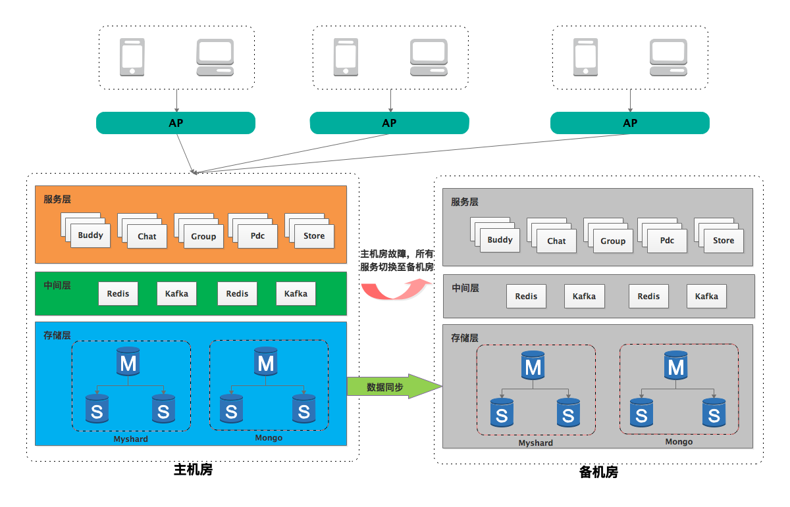

# 高可用架构

1. 采用主备机房部署服务，只有主机房提供服务，边缘机房的接入点AP统一将请求路由到主机房，备机房服务启动但不对外提供服务。存储层数据做单方向的跨机房数据同步。
2. 当主机房遇到整体机房故障时，接入点AP将请求统一切换至备机房，备机房提升为新主机房，并对外提供服务。在此期间，存储层数据由于跨机房数据同步存在延迟，可能会丢弃少量数据，与整体机房故障相比，我们认为这种少量的数据丢弃是可以接受的。
3. 主备机房切换，业务无需做任何改动，IM服务在AP服务上做切换即可。
4. 待原主机房恢复后，原主机房切换为新备机房，存储层数据开始由新主机房向新备机房做数据同步。

